# flezzle-rs-workbook Roadmap

Workbook for studying and co-developing [flezzle-rs](https://github.com/nverhaaren/flezzle-rs).
Each workbook project presents flezzle-rs in a deliberately incomplete state — a git
submodule pinned to a specific point in its history — plus a goal to implement and
supporting exposition. Built for the repo owner's active involvement first, and as an
onboarding/study path into flezzle-rs later.

Workbook projects depend on the corresponding flezzle-rs milestones existing (see that
repo's `ROADMAP.md` — task-dag dependencies are per-file, so cross-repo dependencies are
noted in task text here).

This file is a [task-dag](https://github.com/nverhaaren/task-dag) file — the tables
below are the canonical task store, and the diagram is generated from them.

```mermaid
graph LR
  W1["W1 Define workbook conventions: project directory …"]:::pending
  W2["W2 Project 1 — Sample platformer: set up the `bevy…"]:::pending
  W3["W3 Project 2 — Determinism + portability: minimal …"]:::pending
  W4["W4 Project 3 — Replay: save/replay input traces, p…"]:::pending
  W5["W5 Project 4 — LDtk levels: support user-authored …"]:::pending
  W6["W6 Project 5 — IJON annotations: expose game state…"]:::pending
  W1 --> W2
  W2 --> W3
  W3 --> W4
  W4 --> W5
  W5 --> W6
  classDef pending fill:#3a3a3a,stroke:#666,color:#ddd;
  classDef inprogress fill:#b8860b,stroke:#daa520,color:#fff;
  classDef done fill:#1f7a3f,stroke:#2ea043,color:#fff;
  classDef blocked fill:#8b1a1a,stroke:#da3633,color:#fff;
```

<!-- task-dag:graph -->

<!-- /task-dag:graph -->

## Setup

| ID | Task | Depends on | Status |
|----|------|-----------|--------|
| W1 | Define workbook conventions: project directory layout, submodule pinning workflow, exercise/goal format, how solutions are checked | — | `[ ]` |

## Projects

| ID | Task | Depends on | Status |
|----|------|-----------|--------|
| W2 | Project 1 — Sample platformer: set up the `bevy_ecs_ldtk` platformer example and make sure it runs (flezzle-rs F1) | W1 | `[ ]` |
| W3 | Project 2 — Determinism + portability: minimal adaptations for discrete time steps and a bare-bones browser-playable WASM build (flezzle-rs F2–F4) | W2 | `[ ]` |
| W4 | Project 3 — Replay: save/replay input traces, plus a simple mostly-random trace generator as the start of fuzzing (flezzle-rs F5–F6) | W3 | `[ ]` |
| W5 | Project 4 — LDtk levels: support user-authored LDtk levels starting from a simple example, preserving web play, determinism, and replay (flezzle-rs F8) | W4 | `[ ]` |
| W6 | Project 5 — IJON annotations: expose game state to an exploration harness via IJON-style annotations (flezzle-rs F10) | W5 | `[ ]` |

## Log
